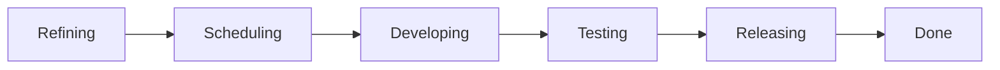

There are a lot of ways to organize humans in the activity of developing software. The popular methodologies like Agile and Kanban are decent for prioritizing the speed of delivering a piece of software while working with a competent and highly autonomous group of workers. Other methodologies like those commonly derided as "waterfall" place emphasis on rigid process to help inform and communicate the progress of delivering software while using process to control for quality.

Regardless of methodology, most software development work is the result of breaking large ideas into smaller, discrete pieces that can be planned out, implemented, and validated before being integrated into a final result. Working through each of the smaller, discrete pieces of work is often represented as a workflow with the following steps:

- Refining
- Scheduling
- Developing
- Testing
- Releasing
- Done

## Refining

When an idea is broken out into a smaller, discrete piece of work, it often is lacking the planning and foresight to include all of the edge cases that ought to be considered in order to build a robust software system. A "created" state allows this work to be represented as having been identified as something that needs to be done, but is not yet ready to be worked on.

While in this state, it is expected to work on refining the ideas into a robust representation of what must be accomplished. This might be setting the expected results of some code or describing the user experience that must be implemented. In Agile terms, the work happening during this state is "refinement" and should ultimately be a collaboration between people defining the requirements and the people expected to build the software.

## Scheduling

Once a piece of work has been refined, it is in a state that is ready to be scheduled for work. Typically a piece of work will be assigned to a particular person who will build software to satisfy the requirements in the piece of work. This state allows a person organizing a team to plan out what the team will be working on for a period of time. In Agile terms, piece of work in this state are able to be organized into sprints. In Kanban terms, this state would indicate that the piece of work is ready to be started.

## Developing

This state describes a piece of work that has been started on by a person building software. While in this state, the person building the software is typically writing code to satisfy the requirements in the piece of work. Depending on the standards that the team sets for itself, part of this work may include writing specialized unit and integration tests to validate the new work.

## Testing

Regardless of whether a team has separate people for building software and for testing software, it is prudent to test what has been built for the piece of work. In this state, the person testing the software is validating that it behaves according to the requirements in the piece of work. This might include collaborating with other people on the team to ensure that it produces the correct output, that the user experience is acceptable, and that the software performs within reasonable time and resource constraints.

## Releasing

Once a piece of work has been tested, it is ready to be made available for use. This might be the act deploying server-side software, integrating the software into a firmware release, or pushing to an app store. Additionally, there may be some communication to other people, organizations, or public announcements needed to inform them about the new or changed software.

## Done

Once the piece of work is released and everyone who needs to know about it has been informed, the piece of work is done.

## Other states

It's common for most workflows to include a "Cancelled" or "Won't Do" state to indicate that a piece of work will intentionally not be completed.
